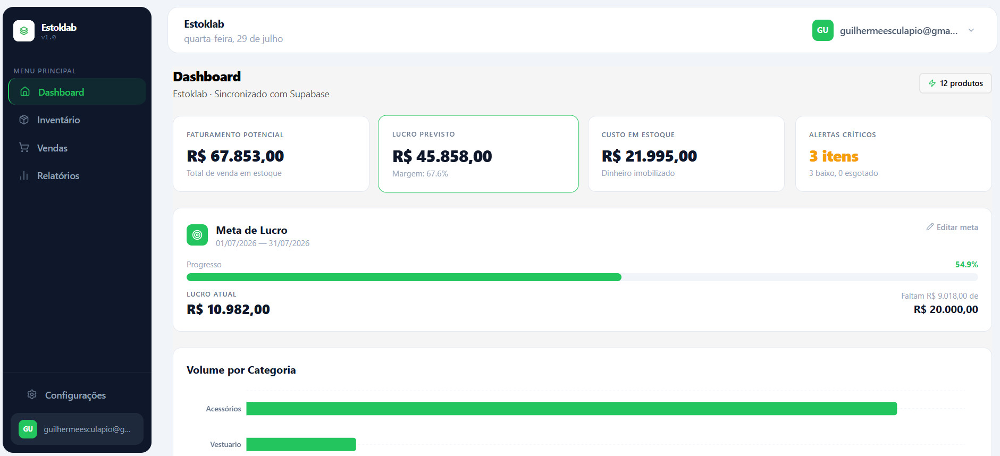
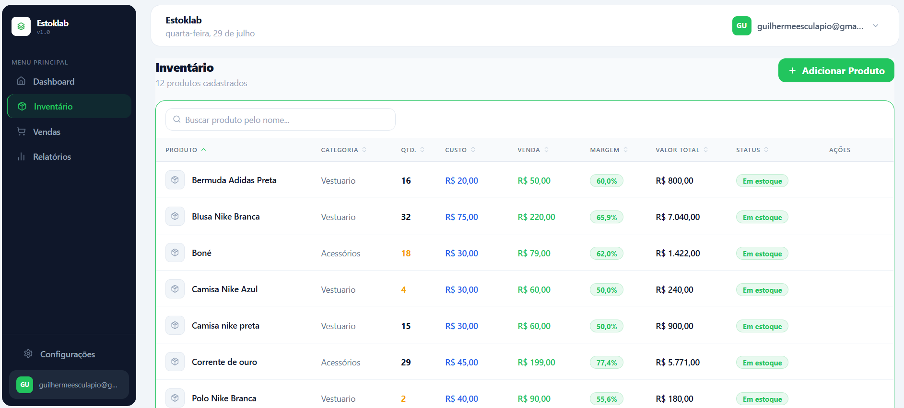

<div align="center">


# Estoklab

**Inventory management system built to solve a real problem.**

[](https://sistema-gestao-estoque.vercel.app/login)
[](https://github.com/guiesculapio/sistema-gestao-estoque)
[](https://react.dev)
[](https://supabase.com)

---

*Um amigo tinha uma loja física e controlava o estoque no papel. Vi o problema, quis resolver.*

*A friend had a physical store and managed inventory on paper. I saw the problem and decided to fix it.*

</div>

---

## 📸 Screenshots

<div align="center">

**Dashboard**


**Inventário**


</div>

---

## ✨ Features

| Funcionalidade | Descrição |
|---|---|
| 📦 **Inventário** | CRUD completo com busca, ordenação e cálculo de margem em tempo real |
| 🛒 **PDV (Ponto de Venda)** | Frente de caixa com leitor de código de barras e baixa automática no estoque |
| 📊 **Relatórios** | Análise financeira com margem, lucro, ROI e capital parado |
| 🎯 **Meta de Lucro** | Barra de progresso motivacional com período personalizável |
| 📄 **Exportação PDF** | Relatórios de entrada e saída de mercadorias |
| ⚠️ **Alertas de Estoque** | Limiar configurável por produto ou global |
| 🔐 **Multi-tenant** | Isolamento real de dados por usuário via RLS no PostgreSQL |
| 👤 **Autenticação** | Cadastro público com confirmação de email via Supabase Auth |

---

## 🛠️ Stack

- **Frontend:** React 18 + Vite + JavaScript
- **Styling:** Tailwind CSS
- **Backend:** Supabase (PostgreSQL + Auth + Storage)
- **Charts:** Recharts
- **PDF:** jsPDF + jsPDF-AutoTable
- **Icons:** Lucide React
- **Deploy:** Vercel

---

## 🏗️ Architecture

O sistema opera sob uma arquitetura **multi-tenant isolada no banco de dados**:

- **Autenticação** gerenciada pelo `auth.users` do Supabase
- **Isolamento via RLS:** toda tabela possui uma coluna `user_id` vinculada ao `auth.uid()` — um usuário nunca acessa dados de outro
- **Fonte única de verdade:** `InventoryContext` centraliza o estado global, métricas calculadas e operações de escrita
- **Camada de dados:** todas as queries do Supabase passam por `src/lib/supabaseClient.js` — nenhuma página faz query direta

**Estrutura de pastas:**
```
src/
├── components/       # Componentes reutilizáveis
│   └── layout/       # Shell da aplicação (Sidebar, Header, Modais)
├── context/          # Estado global (Auth + Inventory)
├── hooks/            # Hooks de dados (categorias, meta, preferências)
├── lib/              # Supabase client, PDF, utilitários de estoque
├── pages/            # Páginas da aplicação
└── utils/            # Funções utilitárias compartilhadas (format.js)
```

---

## 🔑 Key Technical Decisions

**Por que RLS no banco em vez de validação só no frontend?**
Validação client-side é UX — RLS é segurança real. Com múltiplos usuários no mesmo banco, a única garantia verdadeira de isolamento é a policy no PostgreSQL.

**Por que Supabase em vez de backend próprio?**
Era necessário atender uma necessidade real rapidamente, com possibilidade de escala futura. Supabase entrega Auth, PostgreSQL, RLS e API REST sem servidor próprio — ideal para um MVP que precisa de segurança de produção desde o início.

**Por que o schema SQL está versionado no repositório?**
`supabase_schema.sql` documenta as tabelas, constraints e políticas de RLS. Qualquer dev pode entender as decisões de banco sem precisar acessar o painel do Supabase.

---

## 🚀 Getting Started

### Prerequisites
- Node.js 18+
- Conta no [Supabase](https://supabase.com)

### Installation

```bash
# Clone o repositório
git clone https://github.com/guiesculapio/sistema-gestao-estoque.git
cd sistema-gestao-estoque

# Instale as dependências
npm install

# Configure as variáveis de ambiente
# Crie manualmente o arquivo .env.local com as variáveis abaixo


# Execute as migrations
# Cole o conteúdo de supabase_schema.sql no SQL Editor do Supabase

# Inicie o servidor de desenvolvimento
npm run dev
```

### Environment Variables

```env
VITE_SUPABASE_URL=your_supabase_project_url
VITE_SUPABASE_ANON_KEY=your_supabase_anon_key
```

---

## 🗺️ Roadmap (v2)

- [ ] Notificações de estoque crítico por email (Supabase Edge Functions)
- [ ] Histórico de preços por produto
- [ ] Relatório de lucratividade por período com gráfico de tendência
- [ ] Campo de fornecedor nos produtos
- [ ] Testes automatizados (Vitest + Testing Library)
- [ ] PWA — instalável no celular do lojista

---

## 👨‍💻 About

Desenvolvido por **Guilherme Esculápio** — estudante de desenvolvimento web com foco em frontend e interesse crescente em backend e segurança.

Este é meu primeiro projeto real — não um exercício, mas algo que alguém usa de fato. Ainda tenho muito a aprender, e é exatamente isso que me motiva a continuar.

[](https://www.linkedin.com/in/guilherme-e/)

---

<div align="center">
<sub>Estoklab v1.0 · Built with ❤️ to help a friend</sub>
</div>